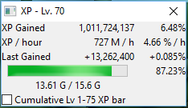
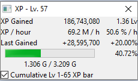
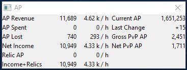
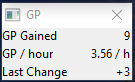
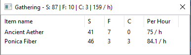
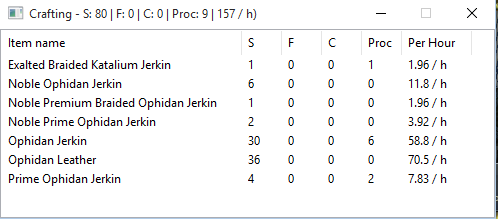
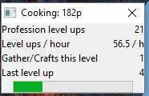
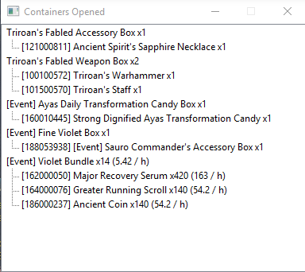
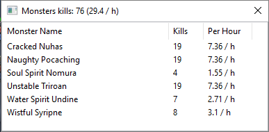

##[Click here for Downloads](https://github.com/maxperiod/aiongrindmeter2/releases)

Aion Grind Meter 2 - Aion XP/hr meter and more

##Screenshots

EXP - progress to next level

EXP - cumulative progress to level 65

AP

GP

Gathering

Crafting

Gathering/crafting profession leveling

Items from container opens

")

Items acquired (except opened from containers)

Monster kills

Player kills and assists

##Overview

Aion Grind Meter contains various grinding meters for Aion: 
* XP gains, XP/hour (Experience gained per hour), levels or percentage per hour, cumulative exp bar to level 65  
* AP gain/loss and AP/hour (Abyss Points gained per hour), AP gain from PvP, AP value of gained relics
* GP gain and GP/hour (Glory Points gained per hour)
* Gathering and/or crafting success/failure/cancellation/procs, successes per hour
* Gathering and/or crafting level ups per hour, estimated XP bars
* Monster kills (per hour)
* Item Acquisitions (per hour)
* Items acquired from container opens
* Player kills (per hour) and assists
* Item dice rolls

It uses the chat log file (Chat.log) to obtain gameplay information. It does not interact or modify the Aion client in any way.

Aion Grind Meter 2 is written in C++ with wxWidgets library powering the Graphical User Interface (GUI).

##Prerequisites

Aion chat log file (Chat.log) must be enabled and present for Grind Meter 2 to work.

Input strings and item names are currently configured for North American service, update 5.0

####Enabling Chat Log
You can use Aion RainMeter (ARM) to enable chat log. 
It can be downloaded from http://rainy.ws/

Once you have enabled chat log using ARM, log into Aion with any one of your characters, and the Chat.log file will be created.

##Setup

Extract the folder to anywhere (Recommended: inside your Aion folder). 
You will be prompted to browse for your Aion folder when you run it for the first time.

You do not need to browse for your Aion folder if you extracted it into your Aion folder.
