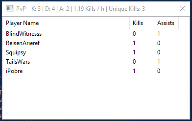

## [Click here for Downloads](https://github.com/maxperiod/aiongrindmeter2/releases)

## Updates

2019-04-05 - Aion Grind Meter 2.4.6 released, now supporting Aion 6.5!

## Screenshots

Items from container opens

")

Items acquired (except opened from containers)

Monster kills

EXP - progress to next level

EXP - cumulative progress to level 75

AP

GP

Gathering

Crafting

Gathering/crafting profession leveling

Player kills and assists

## Overview

Aion Grind Meter contains various grinding meters for Aion: 
* Monster kills
  * List of XP-granting monsters killed
  * Mobs killed per hour, by monster name
* Item Acquisition
  * List of items acquired
  * Items gained per hour, by item ID
* Item Consumption
  * List of items consumed
  * Items consumed per hour, by item name
* Items acquired from container openings 
  * Items acquired from different containers are listed separately
* XP (Experience) mode
  * XP gained, in actual numbers and percentage
  * XP/hour (XP gained per hour), in actual amounts and percentage per hour
  * Actual XP numbers (4 most significant digits)
  * Total XP gained since level 1 (4 most significant digits)
  * Cumulative progress bar to level 75
* AP (Abyss Points) mode
  * AP gained and lost 
  * AP/hour
  * AP gain from PvP
  * AP value of gained relics
* GP (Glory Points) gained and GP/hour
* Profession (Gathering / crafting / aetherforging) mode
  * List of recipes crafted
  * Number of success/failure/cancellation/procs per recipe
  * Successful attempts per hour
* Profession (Gathering / crafting) leveling mode
  * Profession level ups per hour
  * Estimated XP bar toward next skill level, if two level ups have been attained (not yet supported for aetherforging)
* Player kills
  * Number of kills, deaths, and assists in PvP
  * List of players killed (you made last hit) or assisted (you dealt damage to a dead enemy player within 20 seconds)
  * Number of PvP kills per hour
* Item dice rolls
  * For each item that are distribute by dice rolls in a party, the item ID, name, your roll, winning roll, and winner's player name are listed individually

It uses the chat log file (Chat.log) to obtain gameplay information. It does not interact or modify the Aion client in any way.

Aion Grind Meter 2 is written in C++ with wxWidgets library powering the Graphical User Interface (GUI).

## Prerequisites

**Aion chat log file (Chat.log) must be enabled before launching the Aion Client. 
Otherwise, the chat log file will be deleted, and any applications depending on the chat log (including Aion Grind Meter and Aion RainMeter) will not work.** 

**Note: Starting with Aion client version 5.3, the chat log will be automatically disabled (which takes effect the next time you launch Aion client without re-enabling the chatlog) whenever:**
* Starting of the 10-second relog / quit timer
* Relogging from gameplay back to character select screen
* Switching between Standard, Fast-Track / Rookie, and (Integrated) instance servers
* Aion Client is completely shut down (but not with client crashing)

**To prevent the loss of chat log file, always launch either Aion Grind Meter (2.4.0 or later) or Aion RainMeter first before launching the game client.** The timer will not start until you log a character into gameplay.

Input strings and item names are currently configured for North American (NCWest) and Europe English (Gameforge) clients, update 5.3

#### Enabling Chat Log
Aion Grind Meter will automatically enable chat log file (since version 2.4.0) whenever you launch the application, as long as the Aion installation directory have been properly located, and there are no permission issues (e.g. C:\Program Files).

Aion Grind Meter will constantly monitor the system.cfg file and re-enable the chat log whenever it gets disabled for any reason (e.g. Aion 5.3) as long as it is running.

Chatlog enabling is done by adding "g_chatlog = 1" the XOR-encrypted system.cfg file.

**If the Aion client is installed in C:\Program Files, you MUST run Aion Grind Meter as an administrator in order to be able to enable the chat log.**

Alternatively, you can also use Aion RainMeter (ARM) to enable chat log. 
It can be downloaded from http://rainy.ws/

You can find help on chatlog-related issues on the Aion RainMeter website at http://rainy.ws/misc-stuff/

Once you have enabled chat log using any of these methods, log into Aion with any one of your characters, and the Chat.log file will be created.

## Setup

Extract the folder to anywhere (Recommended: inside your Aion folder). 
You will be prompted to browse for your Aion folder when you run it for the first time.

You do not need to browse for your Aion folder if you extracted it into your Aion folder.
